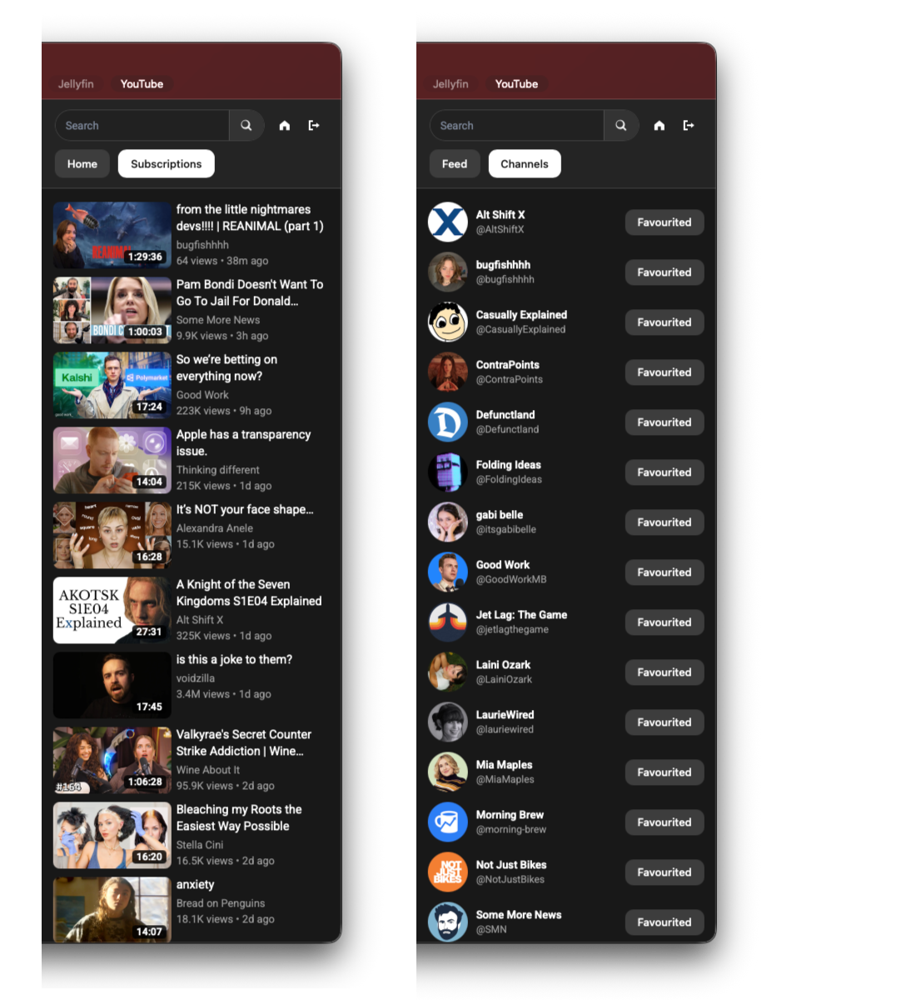

# YouTube IINA Plugin

Plugin for browsing and playing YouTube videos in IINA from a sidebar UI. Includes anonymous mode (favorites-based feed + search) and logged-in mode (Home + Subscriptions).

If you like this plugin you might also be interested in [Jellyfin IINA Plugin](https://github.com/ada-bee/jellyfin-iina).

## Installation

1. Make sure you have the [online-media plugin](https://github.com/iina/plugin-online-media) (`yt-dlp`) installed and working. Before using this plugin, confirm it works by opening and playing a video directly from a URL in IINA.
2. Open IINA Settings > Plugins.
3. Select Install from GitHub.
4. Enter `ada-bee/youtube-iina`.
5. Restart IINA if it does not appear immediately.

## Usage

- Open the YouTube sidebar (Shift + Y).
- On next open, you can use the `Resume YouTube.png` item in Recent Items to skip straight to the sidebar.
- In anonymous mode, search and build a favorites list of channels to populate your feed.
- Optionally, authenticate to load Home and Subscriptions (see [Disclaimer](#disclaimer) about using your Google account).

## Features

- Anonymous mode with merged latest uploads from favorited channels.
- Logged-in mode with personalized Home and Subscriptions feeds.
- Related video recommendations for what to watch next.
- Channel/video search and channel favorites management.
- Playback in IINA by opening standard YouTube watch URLs.
- Optional SponsorBlock integration with per-segment controls (`ignore`, `ask`, `skip`) for Sponsor, Unpaid/Self Promotion, and Preview/Recap.

## Screenshot

## Planned features

- Watch state/progress display and reporting
- Channel view

## Disclaimer

- This project is in an **early development stage** and may break as YouTube changes response formats.
- It uses YouTube InnerTube and other unofficial/private APIs, which may violate YouTube Terms of Service.
- Google account sign-in is optional but risky; use at your own discretion.
